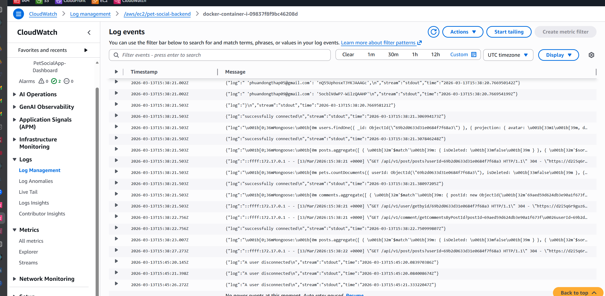
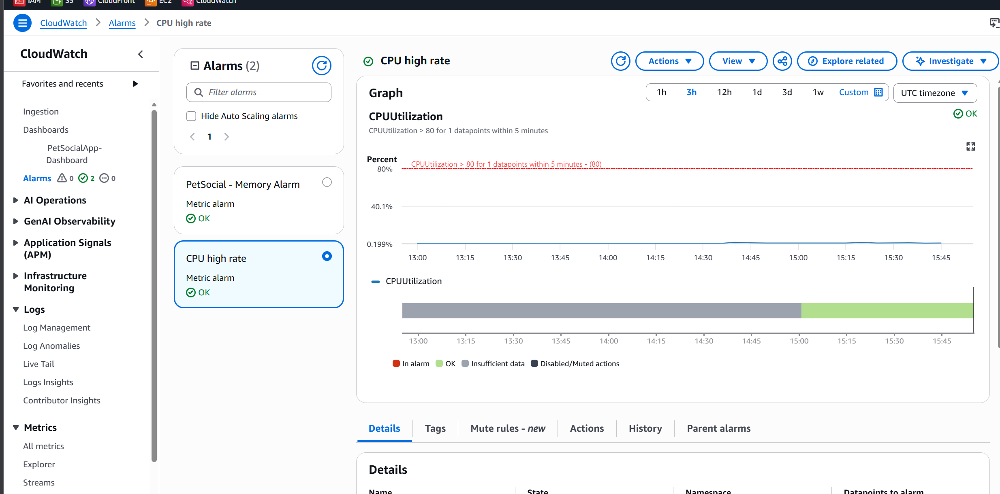
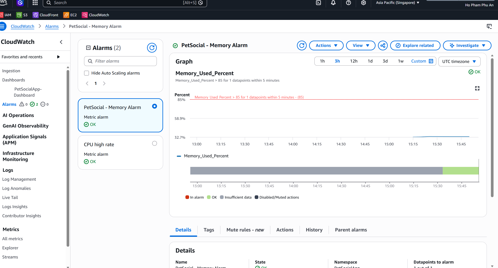
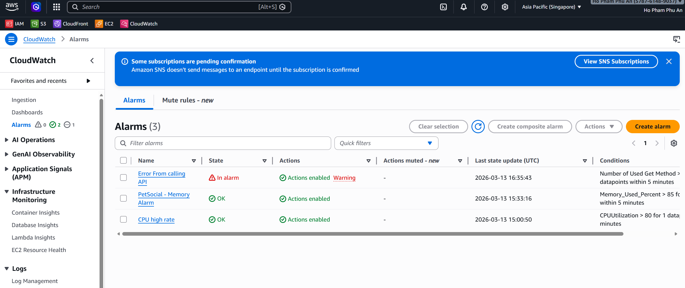
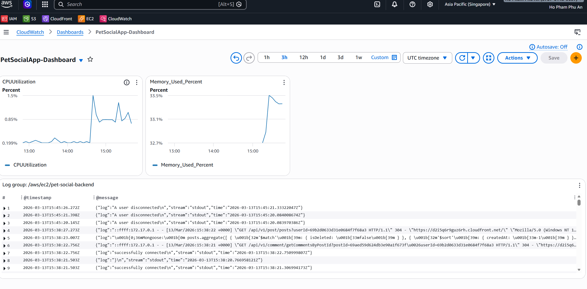

# Monitoring Setup

## CloudWatch Logs

- Log group: `/aws/ec2/pet-social-backend`
- Captured from EC2 CloudWatch Agent :
  

## CloudWatch Metrics

- CPU Utilization
- Memory Used %
- Disk Used %

## CloudWatch Alarms

- CPU > 80% → SNS email

- Memory > 85% → SNS email

- Existing Error log alarm  > 0 -> SNS email

## Dashboard

- https://console.aws.amazon.com/cloudwatch → PetSocialApp-Dashboard
  

Follow visually about CPU Utilization or Used Memory Statistic, especially it is able to track logs from EC2 backend to fix errors timely .